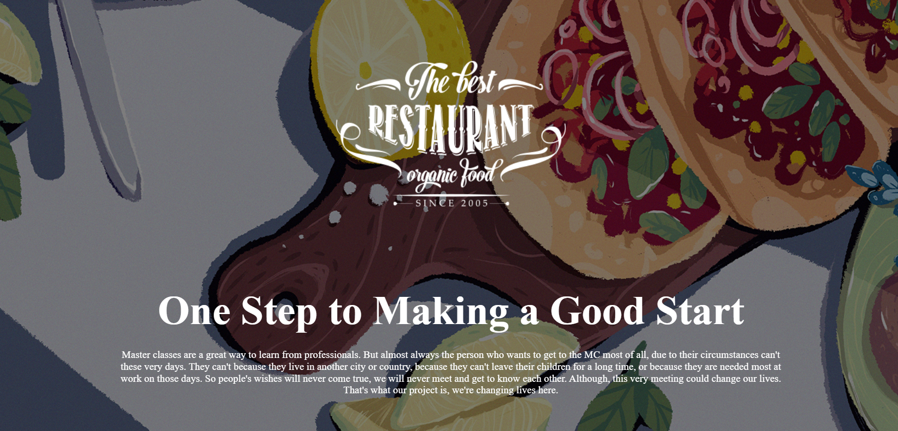
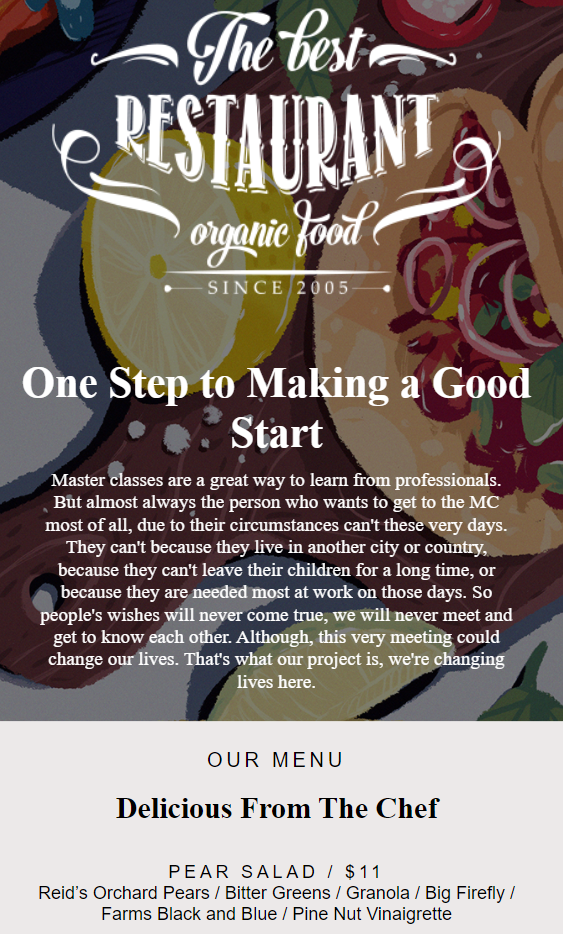
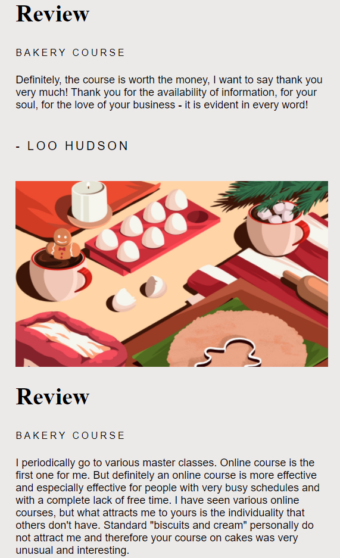

# Learn Cooking

  Learn Cooking is a page containing only HTML and CSS code, it also has a slideshow animation and is adaptive for mobile. </a>

  
<table>
  
  <tr>
  <th></th>
  <th></th>
  </tr>
</table>

# Demo

<a href="https://sabedd00.github.io/learn-cooking/">Learn Cooking - Live DEMO</a>

